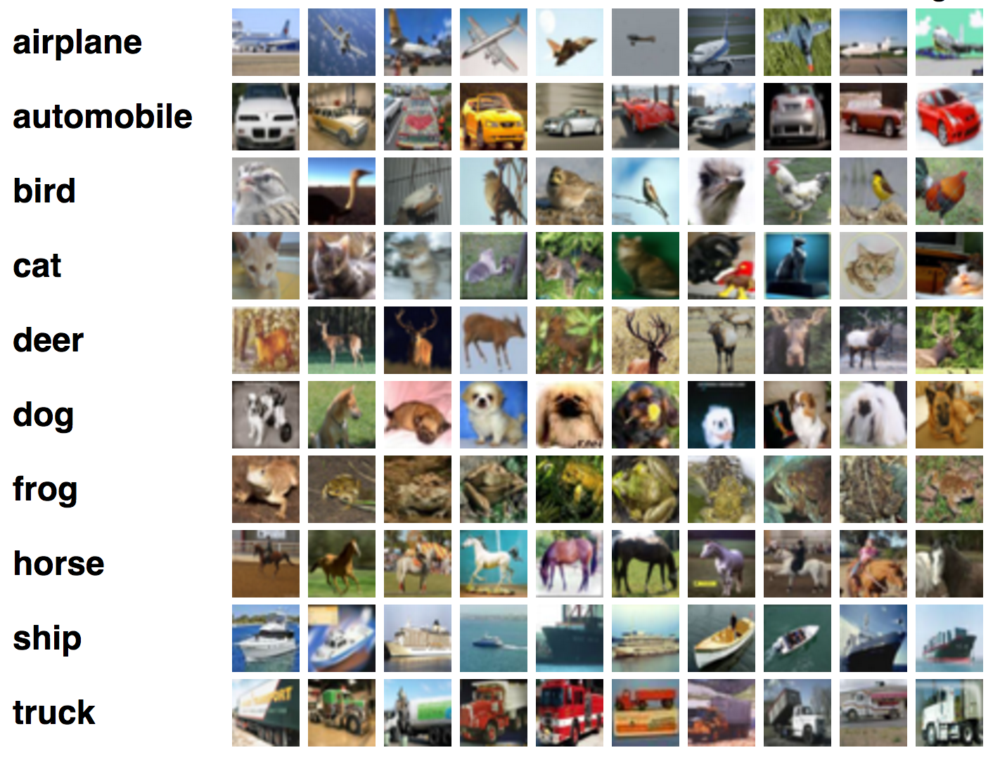

# Image-Classifier

In this project, a convolution neural network in Keras with python on a CIFAR-10 dataset is built. First,the dataset is explored, and then the neural network is trained using python and Keras.

## The CIFAR-10 dataset

The CIFAR-10 dataset consists of 60000 32x32 colour images in 10 classes, with 6000 images per class. There are 50000 training images and 10000 test images.

The dataset is divided into five training batches and one test batch, each with 10000 images. The test batch contains exactly 1000 randomly-selected images from each class. The training batches contain the remaining images in random order, but some training batches may contain more images from one class than another. Between them, the training batches contain exactly 5000 images from each class.

Here are the classes in the dataset, as well as 10 random images from each:

The classes are completely mutually exclusive. There is no overlap between automobiles and trucks. "Automobile" includes sedans, SUVs, things of that sort. "Truck" includes only big trucks. Neither includes pickup trucks.

## Model Architecture

The entire model consists of 6 layers in total. In addition to layers below lists what techniques are applied to build the model.

1. Convolution with 32 different filters in size of (3x3) using ReLU activation function  
2. Convolution with 32 different filters in size of (3x3) using ReLU activation function  
3. Max Pooling by 2  
4. Flattening the 3-D output of the last convolutional operations.  
5. Fully Connected Layer with 512 units using Dropout  
6. Fully Connected Layer with 10 units (number of image classes)  

## Training the model

Train on 50000 samples, validate on 10000 samples  
Epoch 1/10  
50000/50000 [==============================] - 231s 5ms/step - loss: 1.7036 - accuracy: 0.3805 - val_loss: 1.4153 - val_accuracy: 0.4897  
Epoch 2/10  
50000/50000 [==============================] - 230s 5ms/step - loss: 1.3678 - accuracy: 0.5060 - val_loss: 1.2206 - val_accuracy: 0.5686  
Epoch 3/10  
50000/50000 [==============================] - 229s 5ms/step - loss: 1.2041 - accuracy: 0.5709 - val_loss: 1.1226 - val_accuracy: 0.6009  
Epoch 4/10  
50000/50000 [==============================] - 230s 5ms/step - loss: 1.0901 - accuracy: 0.6136 - val_loss: 1.0816 - val_accuracy: 0.6128  
Epoch 5/10  
50000/50000 [==============================] - 228s 5ms/step - loss: 0.9964 - accuracy: 0.6477 - val_loss: 1.0063 - val_accuracy: 0.6429  
Epoch 6/10  
50000/50000 [==============================] - 227s 5ms/step - loss: 0.9158 - accuracy: 0.6761 - val_loss: 1.0138 - val_accuracy: 0.6403  
Epoch 7/10  
50000/50000 [==============================] - 230s 5ms/step - loss: 0.8465 - accuracy: 0.6973 - val_loss: 0.9496 - val_accuracy: 0.6672  
Epoch 8/10  
50000/50000 [==============================] - 229s 5ms/step - loss: 0.7815 - accuracy: 0.7237 - val_loss: 0.9397 - val_accuracy: 0.6670  
Epoch 9/10  
50000/50000 [==============================] - 232s 5ms/step - loss: 0.7271 - accuracy: 0.7436 - val_loss: 0.9404 - val_accuracy: 0.6709  
Epoch 10/10  
50000/50000 [==============================] - 230s 5ms/step - loss: 0.6730 - accuracy: 0.7625 - val_loss: 0.9300 - val_accuracy: 0.6804  

The accuracy increased when the number of epochs was increased to 25.  

Project done by Farissa Erham
